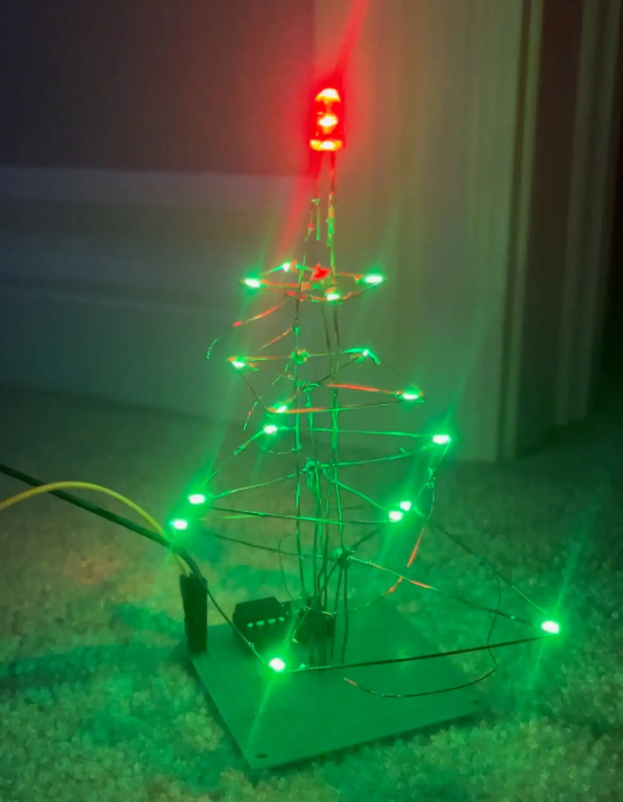

# ATTiny85 Snake 🐍
Tiny handheld gaming console I made for fun.
## Log?
### 12/29/2024
I am writing this log from the future since I didn't really think of placing my process within a repository until now. So... don't worry about it :P

Recently, I received some ATTiny85 MCUs as a gift from someone as a result of finishing exams, and so I thought: "What better way to relax after finals than to start a project!!"

So here I am.

I grew interested in small and portable technology after seeing cool projects online so I decided to try it for myself.

Btw I made a quick LED christmas tree sculpture on christmas eve as a warmup. (see below)

This also used the ATTiny to light up the tree in a way where it counts up in binary!

Anyways. I want to create a simple, small, and portable gaming console that I can take out to play a game of snake when bored. It will have a battery of some sort, buttons, display, and (maybe) an active buzzer.

`MTE262 - Introduction to Digital Logic` prepared me for this. Surely it'll all go well.

### 12/30/2024
I also wanted to try out PCB design in Altium Designer or KiCad to print a circuit board for the device. This will allow me to fit it inside a smaller case and also I'm convinced it will make it a bijillion times cooler.

But before all of that, I need to prototype the thing and make sure everything is working.

Since I'm writing this from the future, I've kind of already done this, but I still have some work left to do. Anyways, here's a brief, ordered summary of what I had to do:

1. Figure out the parts. I have a ton of 8x8 LED Matrices laying around, and I kind of like the way they look, so I'll be using that (For specifics, I'm using the `788Bs 8x8 LED Matrix`). As for the buttons, I just used common `momentary tacticle push button switches`.

2. The 8x8 led matrix has 16 pins while the MCU only has 6 (7 if RST is used) IO pins. This calls for the use of shift registers to increase the amount of outputs I can control. I'm jusing 2 x `SN74HC595N` shift registers in this, for 16 outputs at the cost of 3.

3. After referencing the datasheets for the ATTiny85 and SN74HC595N, I was finished the preliminary wiring and had enough to have the MCU display something to the matrix. (lowkey this took a second to figure out since I had no idea how to program AVR without the Arduino framework but we figured it out eventually lol)

4. Wrote a function to light up one single pixel on the matrix and used it to try out various things. Some optimizations could be done where you can batch some the "draws" on the matrix into one single cycle of 16-bit outputs, however at the speeds it's operating at... I didn't really care to implement that and decided to K.I.S.S.

### 1/2/2025

I left it to rot in bed for a day or two while I contemplated my existance. All good.

Okay! Sweet. So this is what it currently looks like:

You may notice I have the buttons on there too. You know- the ones taking up 1/3 of the board. I am planning on using a resistor ladder in in conjunction with the ADC pins on the ATTiny85 to allow multiple inputs on one pin, however I haven't really finished it since I'm running out of space on the breadboard. Maybe bend the leds of the buttons to only take a 3x3 space on the board instead of 3x4...

### 1/3/2025

It's a new day. I'm planning to get the buttons working today and the rest should all be figuring out the battery and programming the game itself! Oh. I also don't know what register to read for the ADC input. 

An hour or two later... and we have directional input! It took a bit of reading of the ATTiny85 datasheet to figure out how to read the ADC, but we got it!

Okay... now to figure out how snake works. I am not too worried about the space it'll require and the mechanics. HOWEVER, I have no idea how to do random numbers. I either need to have some source of entropy or a good enough algorithm where the output *feels* random